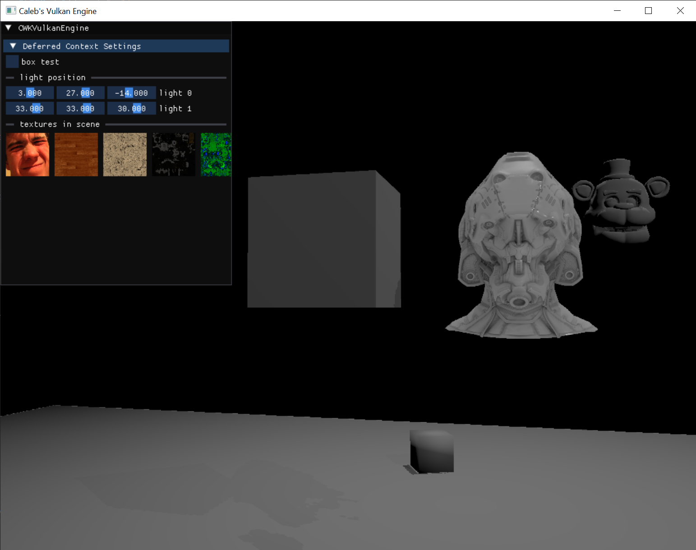
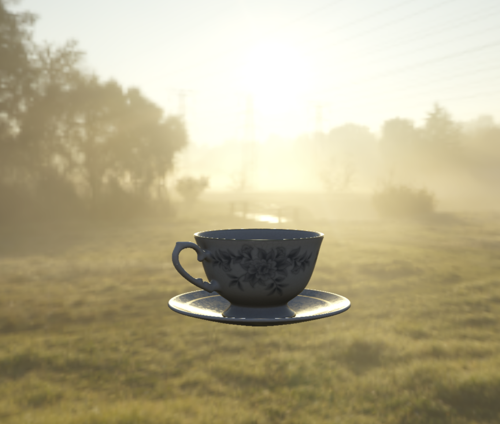

## :wave: :wave: Hello Hello!!! Welcome to my page :wave: :wave:

I'm Caleb. 

:mortar_board: I graduated from **DigiPen Institute of Technology**, with a *Bachelor of Science in Computer Science in Real-Time Interactive Simulation* (RTIS).

:hearts: I love programming C/C++ systems, and am actively developing my own  with Vulkan. 
My goal is to push my knowledge on what's possible with real-time interactive graphics.

:email: Also currently looking for work in the space of systems and graphics programming. 

    <h3>Progress Snippets</h3>
    <table>
      <tr>
        <td align="center">
          
           
          <b>Material Integration in the Engine. <b>WIP</b> from Feb. 2026.</b>
        </td>
        <td align="center">
          
           
          <b>Image-Based Lighting (IBL) from May 2026.</b>
        </td>
      </tr>
    </table>

### Languages

### Libraries

### Development Tools 

